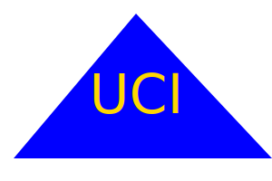

# SVG Logo Maker

## Description
This project is aimed at creating logos for projects to add personality to projects without needing to create it in photo-shop or going through a graphic artist. By answering 4 simple questions, users can create a square, circle or triangle with up to 3 characters placed inside of the letter. Some challenges faced in this project was working with Jest.io. The issue was trying to write tests for code that wasn't written yet. This was a challenge because the test being written requires knowledge of what the final code/output should be. Another challenge was figuring out how to make sure that the colors the user chooses will be web safe for most browsers. 

Example of shapes to be made with the program (code for these can be viewed in the examples/demo folder):

Circle:

Triangle:

Square: 

## Table of Contents
* [Installation](#installation)
* [Usage](#usage)
* [License](#license)
* [Contributing](#contributing)
* [Test](#test)
* [Questions](#questions)
* [Credit](#credit)

## Installation

### Programs needed for this project:
* GitBash (windows) or Terminal (Mac)
* Node.js
* Jest.js

Locate a suitable place where you would like to download this repository. Once found, copy the repositories SSH or HTTPS to clone through the terminal or download the zipfile from GitHub. After it is downloaded, please ensure that node.js is installed. Once it is installed and at least version 18 or higher, go to your terminal, navigate to the directory that contains this repository. Once there, type in "node index" to create your logo.svg file. It will appear in the folder named: examples.

## Demo
Please see the demo of this project [here](https://drive.google.com/file/d/1tgScFvfEV-L8_9kxNjDczvmi8Y41HztI/view)

## Usage
This repository is allowed for use in a learning environment to evaluate and analyze.

## License
    Please see the MIT license found in the repository. To learn more, please click the license badge at the top of the README.MD

## Contributing
* Inquirer for their [node modules](https://www.npmjs.com/package/inquirer)
* Jest for their [node modules](https://jestjs.io/)
* UCI BootCamp for the acceptance criteria.
* AskBCS for their assistance in troubleshooting.

## Test
Use "npm test" in your terminal to run tests on this code.

## Questions
If you have further questions about this project, please send an email or checkout us out on GitHub.

Email: kyleochata@gmail.com

GitHub Link: https://github.com/kyleochata

## Credit
This project was created by Kyle Etrata